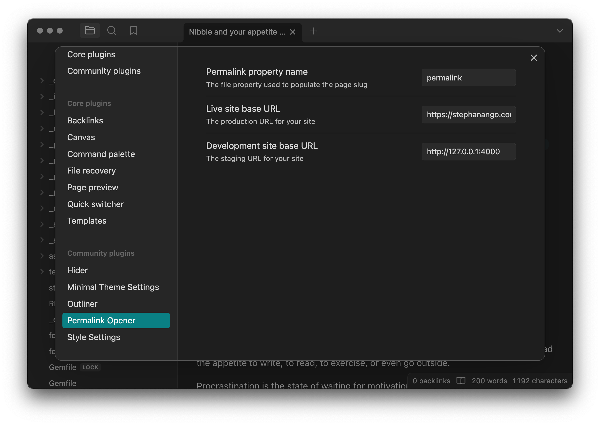

Simple Obsidian plugin that opens URLs based on a permalink or slug in the file properties. This is useful if you use a static site generator such as Jekyll, Hugo, Eleventy, Astro, etc.

Very simple plugin with three settings:

- Permalink property name, defines the frontmattmer property that you use. Defaults to `permalink` but you can set it to `slug` or something else.
- Live site base URL, e.g. `https://yourdomain.com`
- Development site base URL, for Jekyll you might use `http://127.0.0.1:4000`

Use the command palette or hotkeys to open the current page. If no permalink is set the title is slugified using kebab case.

